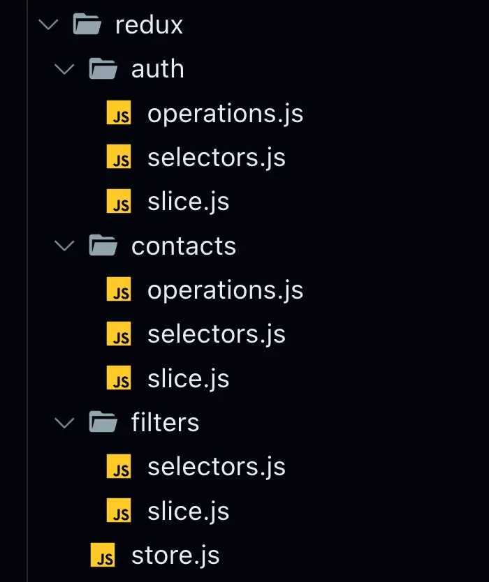

# goit-react-hw-08

## Книга контактів

Додайте у застосунок «Книга контактів» із домашнього завдання попереднього модуля можливість реєстрації та логіна, а також роботу з приватною колекцією контактів. Використовуйте застосунок "Планувальник завдань" з матеріалів, як приклад.

### Бекенд

Для цього завдання є готовий бекенд з [документацією](https://connections-api.goit.global/docs/). Використовуй його замість твого бекенда створеного через сервіс **mockapi.io**.

```
https://connections-api.goit.global/
```

Він підтримує всі необхідні операції з колекцією контактів, а також реєстрацію, логін та оновлення користувача за допомогою JWT.

[](https://goitlmsstorage.b-cdn.net/523237bf-0d31-40cf-8ade-260995bbdabb2024-01-21%2018-23-38.mp4)

### Структура папок Redux

У Redux буде три слайси. Вже реалізовані вами `contacts` та `filters`, а також новий — `auth`, який буде відповідати за стан користувача. Під кожен слайс створіть окрему папку і файли під такі сутності як операції, селектори та логіку слайсу.

У вас має вийти наступна структура:



Перенесіть код з файлів `contactsSlice.js`, `contactsOps.js`, `filtersSlice.js` у нові відповідні файли.

### Слайс auth

Додайте у Redux новий стан `auth` наступної структури:

```
{
  user: {
    name: null,
    email: null,
  },
  token: null,
  isLoggedIn: false,
  isRefreshing: false,
}
```

### Операції слайсу auth

Додайте у файл `redux/auth/operations.js` операції, оголошені за допомогою `createAsyncThunk`, для роботи з користувачем:

- `register` - для реєстрації нового користувача. Базовий тип екшену `"auth/register"`. Використовується у компоненті `RegistrationForm` на сторінці реєстрації.
- `login` - для логіну існуючого користувача. Базовий тип екшену `"auth/login"`. Використовується у компоненті `LoginForm` на сторінці логіну.
- `logout` - для виходу з додатка. Базовий тип екшену `"auth/logout"`. Використовується у компоненті `UserMenu` у шапці додатку.
- `refreshUser` - оновлення користувача за токеном. Базовий тип екшену `"auth/refresh"`. Використовується у компоненті `App` під час його монтування.

Токен авторизованого користувача потрібно зберігати в локальному сховищі за допомогою бібліотеки [persist](https://github.com/rt2zz/redux-persist#readme).

### Маршрутизація

Додайте маршрутизацію з бібліотекою React Router. Компоненти сторінок додайте у папку `src/pages`. Для обгортки компонентів публічних і приватних сторінок використовуйте компоненти `PrivateRoute` та `RestrictedRoute`.

У застосунку мають бути наступні маршрути:

- `/` - маршрут домашньої сторінки додатка, де можна розмістити інформацію про додаток чи його розробника. Рендерить компонент `HomePage`.
- `/register` - публічний маршрут для реєстрації нового користувача, на якому рендериться компонент сторінки `RegistrationPage` з формою `RegistrationForm`.
- `/login` - публічний маршрут для логіна існуючого користувача, на якому рендериться компонент сторінки `LoginPage` з формою `LoginForm`.
- `/contacts` - приватний маршрут для роботи зі списком контактів користувача, на якому рендериться компонент сторінки `ContactsPage`.

Створіть компонент `Layout`, який буде рендерити компонент `AppBar` і огортати усі маршрути, щоб бути доступним на кожному із них.

Компонент `AppBar` має рендерити компонент навігації `Navigation` та `AuthNav`. Водночас авторизований користувач замість `AuthNav` має бачити `UserMenu`.

Обов’язково очищайте колекцію контактів у стані при логауті користувача.

При перезавантаженні сторінки `/contacts` необхідно забезпечити збереження статусу авторизації користувача. Це означає, що система повинна автоматично відновлювати авторизований стан користувача без необхідності повторного введення логіна та пароля.

### Форми

Для форм входу (`LoginForm`) та реєстрації (`RegistrationForm`) краще використовувати бібліотеку [Formik](https://formik.org/).

### Додатково

Це фінальна версія застосунку, тому підходьте до завдання відповідально. Ось список ідей необов'язкових доповнень, які можуть бути в застосунку:

- При введенні у текстове поле пошуку контактів фільтрація виконується не лише за ім'ям, але й за номером телефону.
- При видаленні контакту необхідно підтверджувати операцію через модальне вікно.
- При успішних операціях додавання та видалення контакту користувачу відображається повідомлення за допомогою [React Hot Toast](https://react-hot-toast.com/).
- Контакти можна редагувати, бекенд підтримує PATCH-запит для оновлення контакту.
- Для стилізації можна використовувати бібліотеку компонентів, наприклад [Material UI](https://mui.com/material-ui/).
